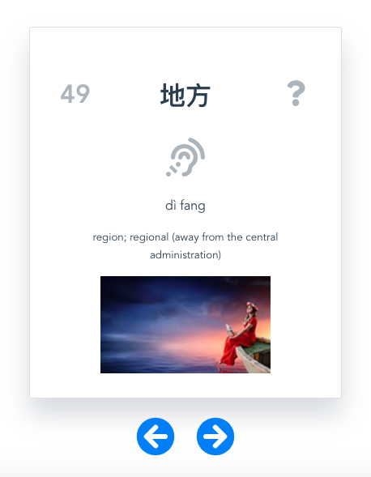

# Chinese Cards

HSK III examnation study helper. It's has 300 HSK words with pinyin and speech.

It's uses Vuejs, [Responsive Voice](https://responsivevoice.org) and [Pixabay API](https://pixabay.com)

## Project setup

```js
npm install

npm run serve
```

## Screenshot


